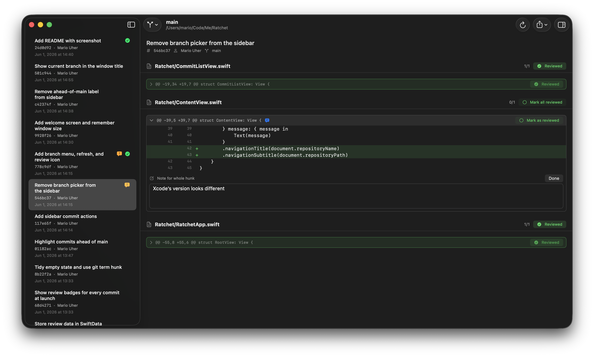

# Ratchet

A native macOS app for reviewing local Git commits — built for reviewing
AI-generated code and handing structured notes back to a coding agent.



## What it does

- **Open any local repository** and browse its branches and commits in an
  Xcode-style sidebar.
- **Switch branches** from the toolbar; commits already merged into `main` are
  dimmed so unmerged work stands out.
- **Review per hunk or per line** — select a range (or use the hover "+") and
  attach a comment; add a whole-hunk note; mark hunks or whole commits reviewed.
- **Content-based tracking** — review state and comments are keyed by the hash
  of the chunk's contents, so a comment auto-resolves when the AI rewrites that
  code, and stays put across rebases/amends.
- **Export** a single commit's notes or *all* comments across the repo as
  Markdown to hand to your agent. Copy a commit's comments with ⌘C, its SHA
  with ⌥⌘C.
- **Persistent** — comments, reviewed flags, and per-commit badges are stored
  locally in SwiftData (SQLite); window size/position and recent repositories
  are remembered.

## Requirements

- macOS 26+
- The `git` command-line tool (Xcode Command Line Tools)

## Build & run

```sh
open Ratchet.xcodeproj
```

Then build and run (⌘R). Pick a repository from the welcome screen, or
**File ▸ Open Repository…** (⌘O). Reopen the welcome screen any time from
**Window ▸ Welcome to Ratchet** (⇧⌘0).

## Notes

- The App Sandbox is disabled so the app can run `git` against arbitrary
  folders you open.
- Review data lives in `~/Library/Application Support/Ratchet/`.
